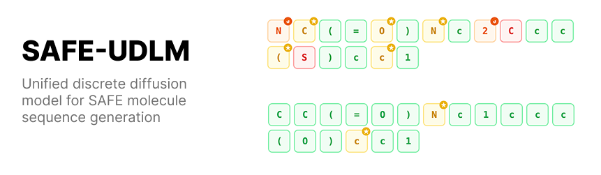

# SAFE-MDLM

<p align="center">
  
</p>

SAFE-MDLM is a molecular generation codebase built around SAFE strings and a masked discrete diffusion language model. It follows the same SAFE tokenizer, data loading, sampler, and experiment workflow as SAFE-UDLM, but uses the MDLM setting from `kuleshov-group/discrete-diffusion-guidance`: absorbing-state diffusion with SUBS parameterization.

The repository is intended for research and experimentation. It focuses on the implementation and workflows, not on reporting model scores in this README.

## What It Provides

- SAFE sequence tokenization and data loading.
- A BERT-style masked language model backbone.
- A local absorbing-state MDLM implementation for training and sampling.
- De novo molecular generation from fully masked SAFE templates.
- Fragment-conditioned workflows for completion, linking, and modification.
- Script-based PMO and lead-optimization experiment entrypoints.
- Hydra configuration for training, checkpointing, sampling, and logging.

## Repository Layout

- `configs/`: Hydra configuration files.
- `src/genmol/`: installable Python package containing the model, diffusion engine, sampler, and utilities.
- `scripts/train.py`: main training entrypoint.
- `scripts/preprocess_data.py`: SMILES-to-SAFE preprocessing helper.
- `scripts/exps/denovo/`: de novo generation scripts and configs.
- `scripts/exps/frag/`: fragment-conditioned generation scripts and configs.
- `scripts/exps/pmo/`: property/oracle-guided molecular optimization scripts.
- `scripts/exps/lead/`: lead-optimization scripts.
- `data/`: small support files used by the sampler and example fragment workflows.
- `oracle/`: auxiliary oracle resources.
- `docs/`: codebase notes and maintenance documentation.
- `LICENSE/`: code, weight, and third-party license files.

Some Python modules still use the historical `genmol` package name for compatibility with existing scripts and checkpoints.

## Installation

The project requires Python 3.10 or newer. The quickest setup path is:

```bash
cd models/safe-mdlm
bash env/setup.sh
```

The package metadata and dependency list are defined in `pyproject.toml`. Environment files are also available under `env/` for manual setup.

## Data Preparation

The default configuration can stream SAFE data from the public `datamol-io/safe-gpt` dataset. To train on a custom SMILES file, convert it to SAFE strings first:

```bash
python scripts/preprocess_data.py ${INPUT_SMILES_FILE} ${OUTPUT_SAFE_FILE}
```

Then set `data=${OUTPUT_SAFE_FILE}` when launching training, or update `configs/base.yaml`.

## Training

Default training settings live in `configs/base.yaml`.

Single-node training can be launched with:

```bash
torchrun --nproc_per_node ${NUM_GPUS} scripts/train.py \
  hydra.run.dir=${SAVE_DIR} \
  wandb.name=${RUN_NAME}
```

Useful configuration fields:

- `loader.global_batch_size`: target global batch size.
- `trainer.devices`: number of visible devices used by Lightning.
- `trainer.max_steps`: total optimizer steps.
- `callback.every_n_train_steps`: checkpoint interval.
- `sampling.steps`: diffusion sampling steps used by the sampler.
- `wandb.project` and `wandb.name`: Weights & Biases logging settings.

The default MDLM settings are:

```yaml
diffusion:
  engine: mdlm
  type: absorbing_state
  parameterization: subs
  zero_recon_loss: False

model:
  time_conditioning: False
```

Checkpoints and run artifacts are written under the Hydra run directory. Local generated artifacts such as `ckpt/`, `logs/`, and `wandb/` are ignored by git.

## Sampling And Experiments

The main workflows are exposed as scripts:

```bash
python scripts/exps/denovo/run.py
python scripts/exps/frag/run.py
python scripts/exps/pmo/run.py -o ${ORACLE_NAME}
python scripts/exps/lead/run.py -o ${ORACLE_NAME} -i ${START_MOL_IDX} -d ${SIM_THRESHOLD}
```

Each experiment directory contains its own configuration files. The sampler can also be used directly from Python through `genmol.sampler.Sampler`.

Example:

```python
from genmol.sampler import Sampler

sampler = Sampler("path/to/checkpoint.ckpt")
samples = sampler.de_novo_generation(num_samples=16)
```

## Development Notes

- Keep reusable model, diffusion, sampling, and chemistry logic in `src/genmol/`.
- Keep scripts thin: parse arguments, load config, call package APIs, and write outputs.
- Do not commit generated checkpoints, W&B files, Slurm logs, or Python bytecode.
- See `docs/CODEBASE.md` for a short map of the source tree.

## License

The code is licensed under Apache 2.0. Additional license details for weights and third-party components are included in `LICENSE/`.
